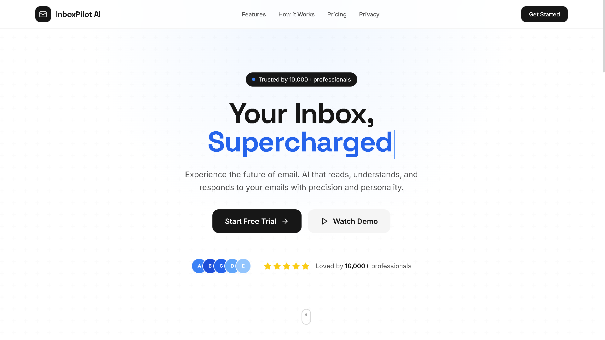
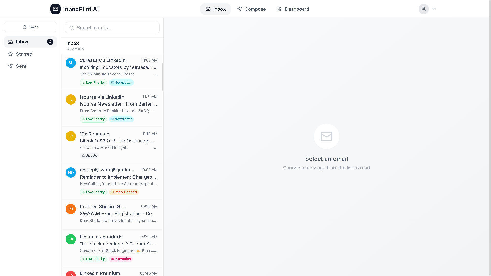
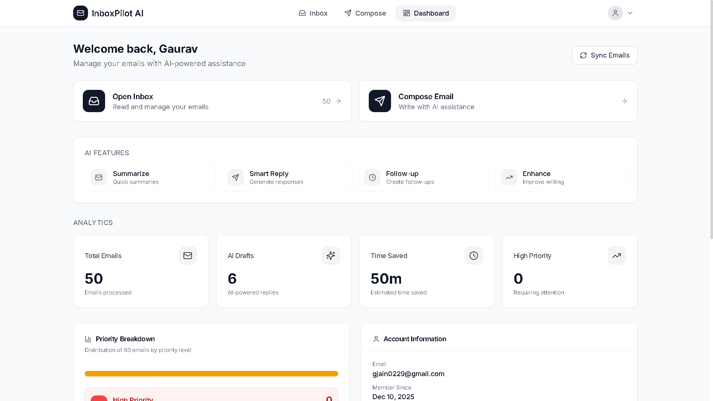

<p align="center">
  
</p>

<h1 align="center">InboxPilot AI</h1>
<p align="center">
  <strong>Executive Email Assistant</strong> — AI-powered Gmail management
</p>

<p align="center">
  <a href="#features">Features</a> •
  <a href="#quick-start">Quick Start</a> •
  <a href="#configuration">Configuration</a> •
  <a href="#color-palette">Design</a> •
  <a href="#deployment">Deploy</a>
</p>

<p align="center">
  
  
  
  
  
</p>

***

## Overview

**InboxPilot AI** is a full-stack, AI-powered email management platform. Connect your Gmail, manage inbox/starred/sent from a modern web UI, and use AI for summaries, smart replies, follow-ups, and compose enhancements. Built with **Next.js**, **Express**, **MongoDB**, and **Google Gemini**.

***

## Features

| Feature | Description |
|--------|-------------|
| **Gmail integration** | Read, compose, reply, star, archive, trash — full inbox control |
| **AI replies & summaries** | Generate context-aware replies with custom tones and one-click thread summaries |
| **Smart compose** | AI-enhanced drafts with tone adjustment to match your writing style |
| **Automated Follow-ups** | Schedule auto follow-up emails with customizable delays (minutes, hours, days). Manage cron-jobs straight from the inbox or dashboard |
| **AI Chat Assistant** | Interactive "Talk to my AI" side-panel to manage your inbox, summarize data, and ask general questions |
| **Priority & categories** | Smart categorization labels: Work, Task, Meeting, Promotions, Reply Needed, etc. |
| **Dashboard & Settings** | Analytics, priority tracking, custom email signatures, and global follow-up management |
| **Secure auth** | Google OAuth 2.0, encrypted tokens |

***

## Screenshots

**1. Landing**



**2. Inbox**



**3. Dashboard**



***

## Tech Stack

| Layer | Stack |
|-------|--------|
| **Frontend** | Next.js 14, React 18, TypeScript, Tailwind CSS, Framer Motion, Zustand |
| **Backend** | Node.js, Express, TypeScript |
| **Database** | MongoDB |
| **AI** | Google Gemini |
| **Auth** | Google OAuth 2.0 |

***

## Quick Start

### Prerequisites

- **Node.js** 18+
- **MongoDB** (local or [MongoDB Atlas](https://www.mongodb.com/atlas))
- **Google Cloud** project with Gmail API enabled
- **Google Gemini** API key ([AI Studio](https://makersuite.google.com/app/apikey))

### 1. Clone & install

```bash
git clone https://github.com/gauravjain0377/InboxPilot-AI.git
cd InboxPilot-AI
```

### 2. Backend

```bash
cd backend
npm install
# Edit .env (see Configuration)
npm run dev
```

### 3. Frontend

```bash
cd frontend
npm install
# Set NEXT_PUBLIC_API_URL=http://localhost:5000/api
npm run dev
```

### 4. Open app

Visit **http://localhost:3000** and sign in with Google.

***

## Configuration

### Google OAuth

1. [Google Cloud Console](https://console.cloud.google.com/) → your project
2. Enable **Gmail API** and **Google Calendar API**
3. **APIs & Services** → **Credentials** → **Create OAuth 2.0 Client ID** (Web)
4. **Authorized redirect URIs**:
   - Dev: `http://localhost:5000/api/auth/google/callback`
   - Prod: `https://your-backend-domain.com/api/auth/google/callback`
5. Use Client ID and Secret in backend `.env`

### Gemini API

1. [Google AI Studio](https://makersuite.google.com/app/apikey) → Create API key
2. Add to backend `.env` as `GEMINI_API_KEY`

### Backend `.env`

```env
GOOGLE_CLIENT_ID=...
GOOGLE_CLIENT_SECRET=...
GOOGLE_REDIRECT_URI=http://localhost:5000/api/auth/google/callback

GEMINI_API_KEY=...

MONGO_URI=mongodb://localhost:27017/inboxpilot

JWT_SECRET=your_jwt_secret_min_32_chars
ENCRYPTION_KEY=your_32_byte_hex_key
ENCRYPTION_IV=your_16_byte_hex_iv

PORT=5000
NODE_ENV=development
FRONTEND_URL=http://localhost:3000
```

### Frontend `.env.local`

```env
NEXT_PUBLIC_API_URL=http://localhost:5000/api
```

***

## Color Palette

InboxPilot AI uses a **black, white & blue** theme. Typography: **Space Grotesk** (headings) and **Inter** (body).

### Primary palette

| Role | Hex | Usage |
|------|-----|--------|
| **Background** | `#FFFFFF` | Page background |
| **Foreground** | `#171717` | Primary text |
| **Muted** | `#737373` | Secondary text |
| **Border** | `#E5E5E5` | Borders, dividers |
| **Accent** | `#3B82F6` | Links, CTAs, focus ring |
| **Accent hover** | `#2563EB` | Buttons, icons on hover |
| **Destructive** | `#EF4444` | Delete, errors |

### Visual reference

```
#FFFFFF  Background
#171717  Primary / Buttons
#737373  Muted text
#E5E5E5  Border
#3B82F6  Accent (blue)
#EF4444  Destructive
```

### Category & priority colors (emails)

| Type | Hex | Example |
|------|-----|---------|
| High priority | `#FEE2E2` / `#B91C1C` | Red |
| Medium | `#FEF3C7` / `#B45309` | Amber |
| Low priority | `#D1FAE5` / `#047857` | Green |
| Work | `#DBEAFE` / `#1D4ED8` | Blue |
| Task | `#F3E8FF` / `#7C3AED` | Purple |
| Meeting | `#E0E7FF` / `#4338CA` | Indigo |
| Promotion | `#FCE7F3` / `#BE185D` | Pink |
| Finance | `#D1FAE5` / `#047857` | Emerald |

***

## Project Structure

```
InboxPilot-AI/
├── backend/
│   └── src/
│       ├── config/         # DB, env
│       ├── controllers/    # Auth, Gmail, AI, Analytics
│       ├── models/         # User, Email, Preferences, etc.
│       ├── routes/         # API routes
│       ├── services/       # Gmail, AI, RuleEngine
│       ├── middlewares/    # Auth, rate limit
│       └── cron/           # Email sync, follow-ups
├── frontend/
│   ├── app/
│   │   ├── page.tsx        # Landing
│   │   ├── login/
│   │   ├── dashboard/
│   │   ├── inbox/
│   │   ├── compose/
│   │   └── settings/
│   ├── components/         # UI, layout, inbox, dashboard
│   ├── lib/                # Axios, utils
│   ├── store/              # Zustand (user)
│   └── public/             # app assets (Next.js)
├── assets/                 # README images (logo, screenshots)
└── README.md
```

***

## API Overview

| Area | Endpoints |
|------|-----------|
| **Auth** | `GET /api/auth/url`, `GET /api/auth/google/callback` |
| **Gmail** | `GET /api/gmail/messages`, `GET /api/gmail/message/:id`, `GET /api/gmail/message/:id/full`, `POST /api/gmail/send`, `POST /api/gmail/message/:id/reply`, `POST /api/gmail/message/:id/read`, `POST /api/gmail/message/:id/star`, `POST /api/gmail/message/:id/trash`, `POST /api/gmail/message/:id/archive` |
| **AI** | `POST /api/ai/summarize`, `POST /api/ai/reply`, `POST /api/ai/rewrite`, `POST /api/ai/followup` |
| **Analytics** | `GET /api/analytics/dashboard` |

***

## Deployment

### Backend (Render)

- **Root**: `backend`
- **Build**: `npm install --include=dev && npm run build`
- **Start**: `npm start`
- Set **env vars**: `GOOGLE_*`, `GEMINI_API_KEY`, `MONGO_URI`, `JWT_SECRET`, `ENCRYPTION_*`, `FRONTEND_URL`

### Frontend (Vercel)

- **Root**: `frontend`
- **Framework**: Next.js
- **Env**: `NEXT_PUBLIC_API_URL=https://your-backend.onrender.com/api`

### Post-deploy

1. Add production redirect URI in Google Cloud Console.
2. Add frontend origin to **Authorized JavaScript origins**.
3. Verify: backend `/health`, frontend login → inbox.

***

## Troubleshooting

| Issue | Checks |
|-------|--------|
| **Failed to connect** | Backend on 5000, MongoDB up, CORS includes frontend URL |
| **OAuth error** | Redirect URI exact match, Gmail API enabled, Client ID/Secret correct |
| **AI generation failed** | Valid `GEMINI_API_KEY`, quota in AI Studio |

***

## Contributing

Contributions are welcome. Open an issue or submit a pull request.

***

## Author

**Gaurav Jain**

| Platform   | Link |
|------------|------|
| **Portfolio** | [gauravjain.tech](https://www.gauravjain.tech/) |
| **GitHub** | [@gauravjain0377](https://github.com/gauravjain0377) |
| **LinkedIn** | [linkedin.com/in/this-is-gaurav-jain](https://www.linkedin.com/in/this-is-gaurav-jain/) |
| **X (Twitter)** | [@gauravjain0377](https://x.com/gauravjain0377) |

***

<p align="center">
  <strong>InboxPilot AI</strong> ~ Smarter email, less noise.
</p>
